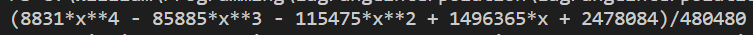
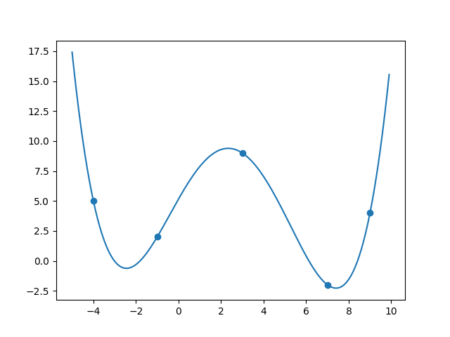

# LagrangeInterpolation

Creating a Lagrange interpolation for a series of points.   
This version uses sympy to factorize the resulting equation, it is also numerically stable but will be slow for long datasets.   

Running main.py produces the following equation and plot: 

Example equation from main.py: 

Interpolated curve with target points: 

